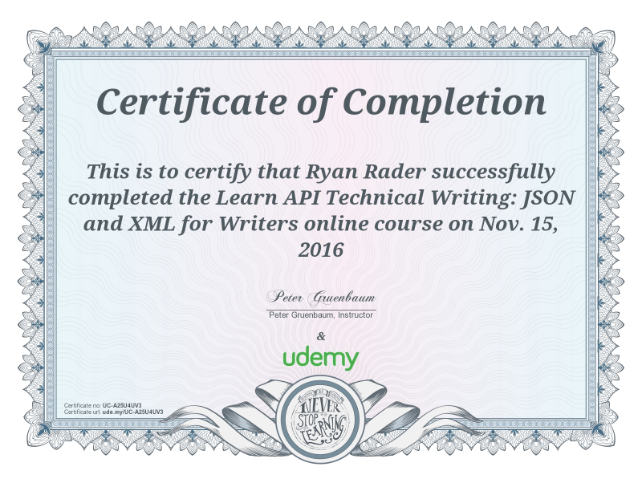
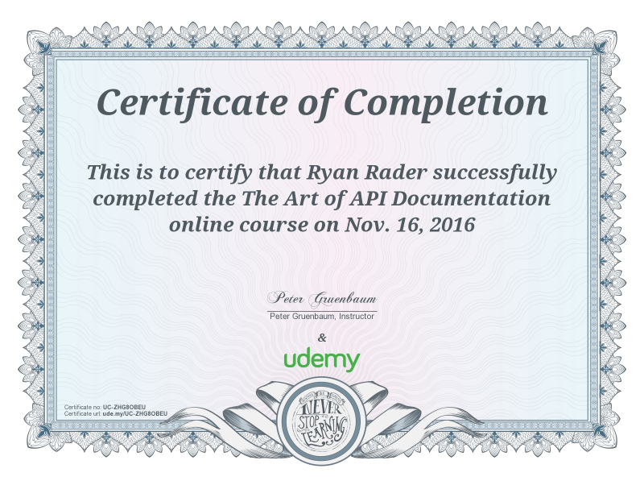

# API and tools

I have extensive experience creating API documentation. For example,
from 2023 to present (2025), I have taken an established software
company with a complex set of APIs from having no API documentation to
having a robust and detailed API reference for each API. This
documentation has increased company revenue by attracting new customers
and also helping to retain existing customers who demanded documentation
for the APIs. For this company alone, the API references that I created
include more than 50 pages and 200 endpoints.

The following links show you two pages out of the various large API
references that I created:

- [Geolocations API](ApiGeolocations.md)

- [Sensors API](sensors-api.md)

## API documentation and testing tools

For testing APIs and gathering the information for documentation, I have
used various tools. The tools I've used most often are Postman and
Swagger (OpenAPI). For small demonstrations of what I can do in those
tools, see the following sections.

### Postman

To demonstrate my capabilities for building API documentation with the
Postman Collections tool, I created the following small sample doc
sites:

- [Open Movie Database API
  docs](https://documenter.getpostman.com/view/26797508/2s93RZNqWX){target="\_blank"}
- [Formula One drivers API
  docs](https://documenter.getpostman.com/view/26797508/2s93XsXRWt){target="\_blank"}

### OpenAPI

I created an API documentation site on github that uses data from the
Swagger PetStore Sample API. I built the site with OpenAPI. I'm very
experienced with CSS, so I can style sites like this to fit any branding
and format that a company needs. You can see this site
[here](https://lookatthem-tech.github.io/PetStoreOpenAPI/#/){target="\_blank"}.

### Madcap Flare and Zendesk

For publishing API documentation, I have also used various methods. I
have published with Postman and OpenAPI (as demonstrated in the
preceding sections).

To fit the requirements of one company, I created a large API
documentation set that I published simultaneously (content reuse in
multiple channels) to a Madcap Flare site and a Zendesk Guide Help site.
The following links show you two of those pages:

- [Geolocations API](https://lookatthem-tech.github.io/portfolio001/Content/Topics/APIDocs/DpGeolocation.htm){target="\_blank"}

- [Sensors API](https://lookatthem-tech.github.io/portfolio001/Content/Topics/APIDocs/StSensors11.3.1.htm){target="\_blank"}

### API course certificates

Also, here are certificates for a few of the API courses that I've
completed.

