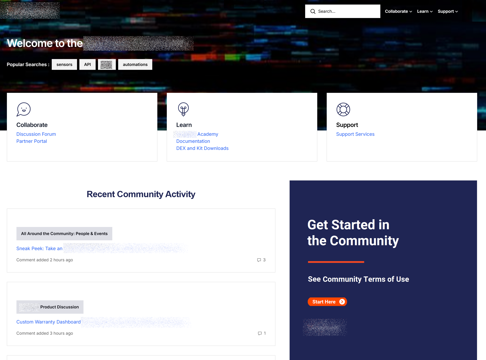

# Tools and processes

The sections on this page show examples of my skills in the areas of
tools and processes.

## SSGs, GitHub, etc.

The following sections show some examples of what I can do with Docs-As-Code tools, static site generators (SSGs), GitHub versioning and deployment, Vercel, Docusaurus, Jekyll, and Sphinx.

### MkDocs

The site you are currently viewing is an example I have built with the Python-based MkDocs static site generator. I stored the site files in GitHub, and edited them in Visual Studio Code. I published the site to GitHub Pages via an Action. In addition to the API pages referenced earlier, this site includes the following API doc samples that I built with the specified UI tool integrations:

- [Swagger UI (aka OpenAPI) Pet Store Example](../ProductCatalog/PetStoreSwgUiTag.md)
- [Stoplight UI Pet Store Example](../ProductCatalog/PetStoreStoplight.md)
- [Swagger UI Manage Rate Plan Example](../ProductCatalog/ManageRatePlan.md)
- [Stoplight UI Hotel Availability Example](../ProductCatalog/HotelAvail.md)

### Next.js

I have built a site with the React-based Next.js static site generator. For this site, I stored the site files in GitHub, and edited them in Visual Studio Code. I then used a GitHub Action to publish the site to Vercel. The site is an ongoing (not totally polished) project. You can see an API page and access the rest of the site here:

- [Next.js doc site](https://portfolionextjs07.vercel.app/API%20and%20Tools/geolocations-api){target="\_blank"} published to Vercel

### Github Pages example

I used GitHub to build, edit, and version, and deploy this portfolio site that you are currently viewing. It is published to GitHub Pages.

### Docusaurus example

I've also created a [separate portfolio
site](https://lookatthem-tech.github.io/DocusaurusPortfolio/){target="\_blank"}
to demonstrate my capabilities with writing, editing, styling (CSS),
building, and deploying Docusaurus sites. I store and version my
Docusaurus content in github, where I also host the site. At this time,
the Docusaurus portfolio includes only a subset of content from this
full portfolio that you're currently viewing.

### Jekyll example

I've also built an example of a developer style of site with Jekyll. I
built the site in a github repo and hosted it on github pages. You can
see it
[here](https://lookatthem-tech.github.io/jekyll-project-03/index.html){target="\_blank"}.

### Madcap Flare example

If you use Madcap Flare to create your Help content, you might also want
to use Flare to create and maintain your API documentation. Here are two
API reference examples that I created with Flare. I then built and
hosted them in a github repo.

- You can see an example with a two-column format
  [here](https://lookatthem-tech.github.io/ApiDocsInFlare/Output/ryan_/HTML5/Content/RRTest.htm){target="\_blank"}.

- You can see an example with a three-column format
  [here](https://lookatthem-tech.github.io/ApiDocsInFlare/Output/ryan_/HTML5/Content/RRApiReference3Col.htm){target="\_blank"}.

To fit the requirements of one company, I created a large API
documentation set that I published simultaneously (content reuse in
multiple channels) to a Madcap Flare site and a Zendesk Guide Help site.
The following links show you two of those pages:

- [Geolocations API](ApiGeolocations.md)

- [Sensors API](sensors-api.md)

### Sphinx site example

I have a similar portfolio site that I built with sphinx to demonstrate
what I can do with that tool.

!!! note "Note"

    I haven't hosted this site anywhere yet. But I'll be happy to show it to anyone who asks!

## Zendesk theme development

To meet company needs for publishing content to various locations and
formats for various purposes, I learned to publish from Madcap Flare
into Zendesk (while publishing the same content into other sites from
Flare). I also learned to import and export content via Zendesk's API
and other methods.

I am also well-versed in developing Zendesk themes (with .hbs and .css)
and then publishing and maintaining these themes for Zendesk Guide and
Zendesk Gather (Community).

