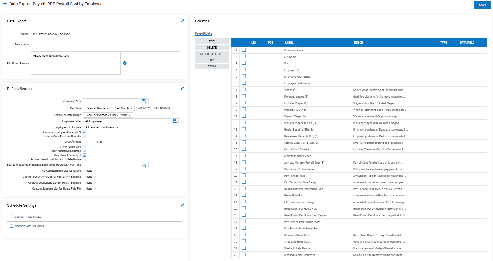
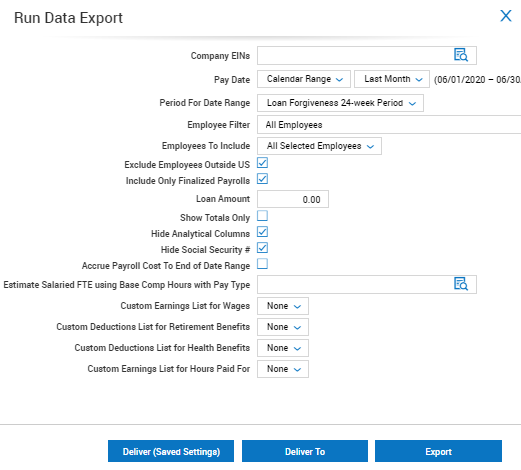
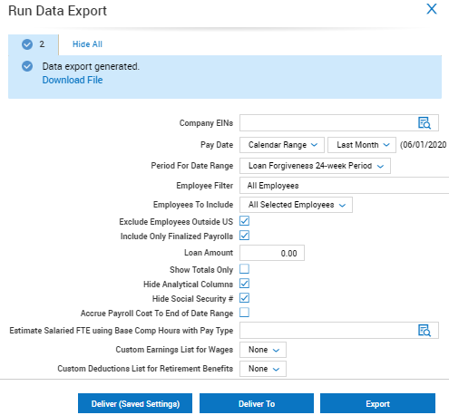
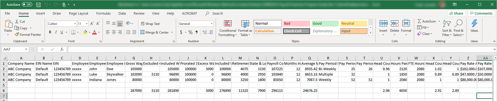

# COVID-19 Paycheck Protection Program User Guide

The COVID-19 Paycheck Protection Program (PPP) is a loan designed to
provide a direct incentive for small businesses to keep their workers on
the payroll.

This User Guide leads you through the steps to create an export in UKG
Ready as you apply for a PPP loan. You can also use the export to get
the information you need for loan forgiveness.

The Small Business Administration (SBA) will forgive loans if all
employees are kept on the payroll for eight weeks and the money is used
for payroll, rent, mortgage interest, or utilities.

For more details, please read the information on the SBA website:

[https://www.sba.gov/funding-programs/loans/coronavirus-relief-options/paycheck-protection-program](https://www.sba.gov/funding-programs/loans/coronavirus-relief-options/paycheck-protection-program){target="\_blank"}

[Download this User Guide as a PDF](https://lookatthem-tech.github.io/portfolio001/Content/Topics/Software/CovidPppUG/CovidPppUG.pdf){target="\_blank"}

## Creating PPP Exports

To assist in your PPP loan application process, you can create a data
export file.

The main data this export provides is:

- Average monthly payroll cost (including all the totals to get to that
  average cost)

- Average headcount over a date range

- Pay rate information for each employee

You use the Average Monthly Payroll Cost as you apply for the loan. The
additional data on Headcount and Pay Rate helps you meet the reporting
requirements to get loan forgiveness.

Create the export as the data export type **PPP Payroll Cost by
Employee**, which you can find under **Company Settings \> System Data
Export \> Data Exports.**

1.  Click the **New Data Export** button.

2.  Select the **PPP Payroll Cost by Employee** export.

    

3.  Click the check boxes to select which columns you want to include.
    To remove columns, select them and then click **Delete** or **Delete
    Selected**.

4.  To change the order of the columns and edit the labels, select a
    column and click **Edit**, **Up**, or **Down**.

5.  To understand how calculated columns are calculated, see the
    Description.

6.  **Save** the file.

7.  Click the **Run Data Export** button.

    

8.  If you are a multi-EIN company, select one or more EINs.

9.  Set the Pay Date (if the default is not correct).

10. Verify or set the option for including or excluding only finalized
    payrolls.

11. Verify or set the option for including or excluding employees
    outside the U.S.

12. Click **Export** to export the report as a .csv file. You can also click the **Download File** link to download the exported .csv file.

    

    

## Using PPP Exports

You can create multiple versions of PPP exports. The following sections
cover four different versions that you could create for the export.

- Create a version of the PPP export for the Loan Application.

- Create a version of the PPP export for the Headcount Lookback Period.

- Create a version for the PPP export for the Wage Reduction Lookback
  Period.

- Create a version of the PPP export for Loan Forgiveness.

### Configuring Filters for the Export

1.  Company EINs: If you have separate loan applications for each EIN,
    you might want to create separate exports for each EIN.

2.  Pay Date: Use a Pay Date range for each export as applicable.

3.  Period For Date Range: Use the appropriate period for which you are
    running the report. The system uses this period to calculate the
    correct excess wages cap for the period.

4.  Employee Filter: Use your own list of Employees to include

5.  For Employees to Include, you have three filter options:

    - Select **All Selected Employees** to include all employees who
      would be selected by the other filters.

    - Select **Non-Owner Employees with MORE/LESS than 100k in 2019
      annualized** to get the employees you need for PPP Schedule A
      Worksheet - Table 1 and Table 2.

    - Select **Owner Employees** to filter the wages for employees who
      need to be reported in PPP Schedule A - Line 9. This includes any
      employee in the system with an **Ownership Percentage** above 0%.

6.  Exclude Employees Outside US: You are required to exclude all
    employees who have their primary address outside of the U.S. Use the
    **Exclude Employees Outside US** filter to exclude all employees who
    currently have a primary address outside of the U.S. However, if you
    had employees who had a primary address outside of the U.S. in the
    date range, but their primary address in the Ready was inside the
    U.S., use the **Employee Filter** to exclude them.

7.  Select whether to **Include Only Finalized Payrolls**.

8.  Loan Amount: Use this for the Loan Forgiveness Export to determine
    how your Total Payroll Cost is tracking towards your loan.

9.  Show Totals Only: Use this to view only the summarized data included
    in your date range for the export, without having to scroll through
    each employee's individual numbers.

10. Hide Analytical Columns: Select this to hide the Head Count columns
    that you don't need for comparison. This can help you to avoid
    confusion about which Head Count columns to use.

11. Hide Social Security #: The export contains a masked Social Security
    \# containing the last four digits that are needed for PPP Schedule
    A Worksheet -- Table 1 and Table 2. You can hide this column when
    you run the report and don't want to include this information.

12. Accrue Payroll Cost To End of Date Range: Select this to make the
    export estimate incurred costs up to and including the end date of
    the date range. Finalized payrolls that ended before but are not
    paid until after the end date will be fully included. Finalized
    payrolls that started before but end after the end date will have a
    percentage included.

13. Estimate Salaried FTE using Base Comp Hours with Pay Type: If you do
    not track hours for your salaried workers, select the pay types that
    identify your salaried workers. If you use this filter, any
    employees with the selected pay type will have their **Hours Paid
    For** based on their Hours configured in their **Base
    Compensation.** This will ignore their hours on their pay statement
    and use the estimated hours in the pay periods in which they were
    paid to calculate their FTE.

    !!! tip "Tip"

        This setting will show employees with other pay types, using the actual hours (instead of the estimated hours) for which they were paid.

14. Custom Earnings List for Wages: If you select None , the export will
    include all Regular Wages, Cash, and Reimbursements. If you gave
    Reimbursements to your employees through payroll that should not be
    included in the Payroll Costs or you have other Earnings that should
    be included or excluded in the Wage total, create an Earnings List
    that includes all the earnings that should count toward the PPP
    loan. Then use this Earnings List for all your PPP exports.

    !!! note "Note"

        It doesn't matter whether you include or exclude FFCRA Sick Pay or Family Leave in this list. The export will exclude them in the Excluded Wages column if you add them to this Earnings List.

15. Custom Deductions List for Retirement Benefits: If you select None,
    the export will include all the Employer portions of Pension
    deductions. If you supply retirement benefits through different
    deductions codes than the Ready pension deduction types, create a
    Deductions List that includes all the deductions that should count
    toward the PPP loan as retirement benefits. Then use this Deductions
    List for all your PPP exports.

16. Custom Deductions List for Health Benefits: If you select None, the
    export will include all the Employer portions of Default, FSA, HSA
    and Cobra deductions. If you supply health benefits through
    different deductions codes than the Ready deduction types or some of
    your default deduction types are not health benefits, create a
    Deductions List that includes all the deductions that should count
    toward the PPP loan as health benefits. Then use this Deductions
    List for all your PPP exports.

17. Custom Earnings List for Hours Paid For: If you select None is
    selected, the export will include only Actual Work Hours. If your
    Earning Codes were not configured to correctly capture Actual Work
    Hours or you have hours that are or are not captured in Actual Work
    Hours that should be included or excluded, create an Earnings List
    that includes all the hours that should count toward the PPP loan.
    Then use this Earnings List for all your PPP exports.

    !!! note "Note"

        It does matter whether you include or exclude **FFCRA Sick Pay** or **Family Leave** in this list. The export will include any hours associated to them if you add them to this Earnings List.

### Creating a Loan Application Export

Select the date range that is relevant for your business:

1.  Use the **Period For Date Range** filter and select **Lookback
    Period**

2.  If you are a new business (defined as starting after February
    15, 2019) use a Date Range of **January 1, 2020 -- February 29,
    2020**.

3.  If you are a seasonal business use a Date Range of **March 1, 2019
    -- June 30, 2019**.

    !!! tip "Tip"

        You can also use February 15, 2019 - June 30, 2019. However, this might bring your average monthly payroll costs down because an extra month is included, and you might be missing one or more pay dates in February.

4.  All other employers should use a Date Range of **January 1, 2019 --
    December 31, 2019** and a Calendar Range of **Last Year**.

    !!! note "Note"

        Use the same date range for both of the preceding filters.

The columns to include for the loan application depend on what your bank
requests to include in the application. Here are some columns you might
include:

- Wages (\$)

- Excess Wages (\$)

- Retirement Benefits (ER) (\$)

- Health Benefits (ER) (\$)

- State & Local Taxes (ER) (\$)

- Payroll Cost Total (\$)

- Average Monthly Payroll Cost (\$)

- Head Count Per Pay Period Paid: Use this column to show that you
  qualify by having less than 500 employees.

### Creating a Lookback Period for Head Count Export

The government provides two date ranges that you can use as a baseline:

- January 1, 2020 - February 29, 2020

- February 15, 2019 - June 30, 2019

Your company probably wants to use the date range that has the lowest
head count as the baseline head count.

The export provides two columns for Head Count:

- Combined Head Count: This assumes Employees with zero hours are
  full-time, so use Head Count Per Pay Period Paid. Otherwise, it uses
  Head Count Per Hours Paid Capped.

- Simplified Head Count: This assumes Employees with zero hours are
  full-time, so use Head Count Per Pay Period Paid. If they are paid in
  each pay period, they will count as 1.0. Otherwise, they count as 0.5
  for the date range. For any employee with Hours Paid For, if the
  average hours per week is at least 40 hours, the employee will count
  as 1.0 (otherwise, 0.5).

You can use **Combined Head Count** or **Simplified Head Count** to
determine the FTE head count. You also need to use the same field for
the comparison in the Loan Forgiveness Export.

!!! note "Note"

    The columns for **Head Count Per Pay Period Paid** and **Head Count Per Hours Paid Capped** may be available for analytical purposes if the Hide
    Analytical **Columns** filter is unchecked.

### Creating a Lookback Period for Wage Reduction Export

The date range for this export is the quarter before your loan. In most
cases, this would be:

- January 1, 2020 - March 31, 2020

- Other, if your loan did not start until after June 30, 2020

- Only employees who made less than 100k annualized in every pay period
  in 2019 need to be included. You can filter these by using the
  **Employees to Include** filter and selecting **Non-Owner Employees
  with LESS than 100k in 2019 annualized.**

### Creating a Loan Forgiveness Export

Select the date range for your loan Covered Period or the Alternative
Payroll Covered Period. This should be exactly 8 or 24 weeks. (So if the
loan started on a Monday, the end of the date range should be a Sunday.)

!!! tip "Tip"

    Use **Date Range** not **Calendar Range.**

Use the **Period For Date Range** filter, and select the correct **Loan
Forgiveness Period** (8 or 24 weeks).

Here are some columns you might include:

- Wages (\$)

- Excluded Wages (\$)

- Excess Wages (\$)

- Included Wages to Cap (\$)

- Retirement Benefits (ER) (\$)

- Health Benefits (ER) (\$)

- State & Local Taxes (ER) (\$)

- Payroll Cost Total (\$)

- Combined Head Count

- Simplified Head Count

!!! warning "Important"

    If you had any employees making over 100k annualized in at least one pay period in 2019, you need to create two additional versions of this export: Make one version with Employees who made more than 100k annualized in at least one pay period in 2019, and make another version with Employees who made less than 100k annualized in all pay periods in 2019. You can use these for the two tables requested in the SBA Form 3508 - PPP Schedule A Worksheet.

## Completing SBA Form 3508 (PPP Schedule A)

The following is line by line guidance on how to complete PPP Schedule
A:

**Line 1:** Use Included Wages to Cap (\$) from your Loan Forgiveness
Export with employees who made less than 100k annualized in all pay
periods in 2019.

**Line 2:** Use Combined Head Count or Simplified Head Count from your
Loan Forgiveness Export with employees who made less than 100k
annualized in all pay periods in 2019.

If you have FTE Reduction Exceptions, you need to add these to the total
(see the PPP Schedule A Worksheet -- Table 1).

**Line 3:** Use your Loan Forgiveness Export with employees who made
more than 100k annualized in at least one pay period in 2019 to identify
which employees have not had an average wage reduction of at least 75%.
Compare this to their average wages in the Lookback Period for Wage
Reduction Export. (See the instructions on the PPP Schedule A Worksheet
for further details.)

**Line 4:** Use Included Wages to Cap (\$) from your Loan Forgiveness
Export with employees who made more than 100k annualized in at least one
pay period in 2019.

**Line 5:** Use Combined Head Count or Simplified Head Count from your
Loan Forgiveness Export with employees who made more than 100k
annualized in at least one pay period in 2019.

**Line 6:** Use Health Benefits (ER) (\$) from your Loan Forgiveness
Export including all employees in the U.S.

**Line 7:** Use Health Retirement (ER) (\$) from your Loan Forgiveness
Export including all employees in the U.S.

**Line 8:** Use State & Local Taxes (ER) (\$) from your Loan Forgiveness
Export including all employees in the U.S.

**Line 9:** Use Owner Employees to select the wages for employees who
need to be reported here. This includes any employee in the system with
an **Ownership Percentage** above 0%.

**Line 10:** Use Payroll Cost Total (ER) (\$) from your Loan Forgiveness
Export including all employees in the U.S.

**Line 11:** Use Combined Head Count or Simplified Head Count from your
Lookback Period for Head Count Export.

**Line 12:** Use Combined Head Count or Simplified Head Count" from your
Loan Forgiveness Export including all employees in the U.S. If you have
FTE Reduction Exceptions, you need to add these to the total (see PPP
Schedule A Worksheet -- Table 1).

**Line 13:** Use the math provided in the worksheet.

!!! tip "Tip"

    You can use all the amounts in PPP Schedule A to fill out your PPP Loan Forgiveness Calculation Form.
