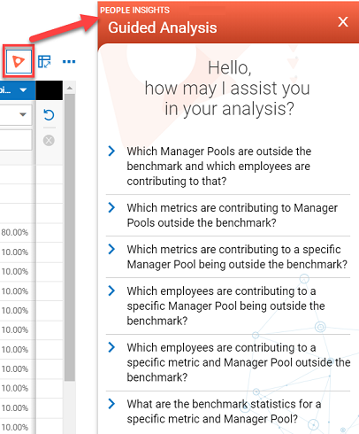
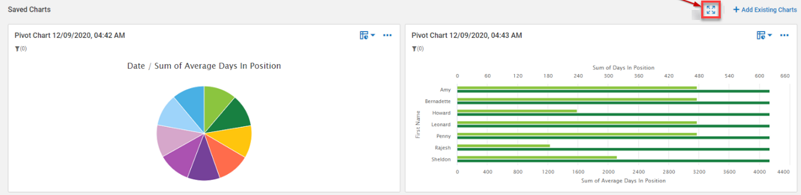
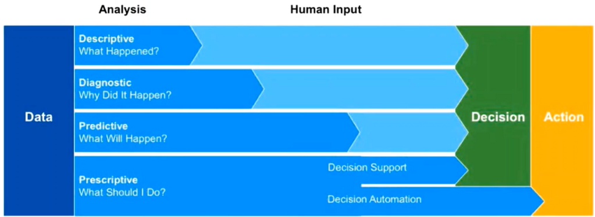
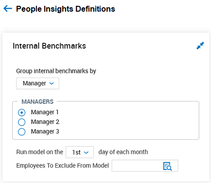
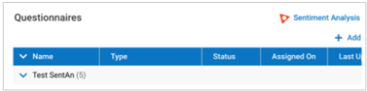

# People Insights User Guide

The simplicity of working on one unified platform means all your
workforce data is easily accessible to all teams and ready for you to
leverage to make better-informed workforce decisions. The People
Insights tools built into the system enable you to easily access the
day-to-day, tactical data you need to effectively manage employees. In
addition, the data can help guide your long-term workforce strategies
with emerging trends and predictive forecasts revealed through a
powerful combination of configurable metrics and intuitive, AI-generated
insights and alerts.

[Download this User Guide as PDF](https://lookatthem-tech.github.io/portfolio001/Content/Topics/Software/PeopleInsightsUG/PeopleInsightsFullUG.pdf){target="\_blank"}

## Analytics Features

You can configure a People Insights tile for managers. You can also add
shortcuts on the home page for users.

### Header Icon

In the application header, managers see the People Insights icon. Click
this icon to go directly to People Insights, without having to click
through menus or options.

### Home Dashboard Tile

The People Insights tile is available to managers to get quick,
at-a-glance, information about employee Flight Risk probabilities and
trends. The tile summarizes the high-level information related to Flight
Risk described in the following three sections.

#### Employees with Highest Flight Risk

This area shows up to three employees with the highest Flight Risk
probability, calculated for the current month. To prevent these
employees from leaving, you should take immediate action.

#### Likelihood of Employees Leaving

This area shows the distribution of a manager's employees (based on
Group visibility) and their likelihood of leaving. Categories include
**Very Likely**, **Somewhat Likely**, and **Not Likely**. You also see
the percentage change (increase or decrease) for each category from the
previous month to the current month, and the number of People Insights
by category.

#### Top Re-engaged Employees

This area shows up to three employees with the most improved (or
recovered) Flight Risk probability. These employees previously had a
high flight risk, and you have succeeded in re-engaging them. The system
compares the previous month to the current month.

### Dashboard Layout

You can add the Flight Risk Insights widget to the Dashboard Layout
Profile at **Company Settings \> Profiles/Policies \> Dashboard Layout
\> Dashboard Layout Profiles**. Tabs can also be individually managed
under **Company Settings \> Profiles/Policies \> Dashboard Layout \>
Dashboard Tab Library**.

## Analytics Module Dashboard

Like other module dashboards in the system, the Analytics Dashboard
allows you to add charts for daily, weekly, or monthly monitoring. In
addition, the Analytics Dashboard enables you to add enhanced Pivot
Charts. You can use the Pivot Charts to slice and dice Metrics by the
available Dimensions.

The Pivot Charts available in People Insights assist with data
summarization, allow for easy data categorization, and filter data into
useable pieces. You can define the fields to include in Pivot Charts
based on the data most important to your organization.

!!! tip "Tip"

    If the Pivot Chart has not been added to a report in the past, add it to a report first.

### Creating Charts Based on Pivot Tables

You can create charts based on Pivot Tables. You then can switch the
Pivot Tables to the following types of charts:

- Horizontal Bar

- Vertical Bar

- Line

- Scatter

- Pie

- Tree Map

- Bubble: A Bubble chart is an extension of a scatter plot that you can
  use to show the correlation between at least three variables. You can
  also add a Bubble chart to the Dashboards.

- KPI: You can create the KPI chart from a Pivot Table to see the data
  as aggregated numbers.

You can sort the values in columns and rows in a Chart separately from
the sorting applied in the Pivot Table. The sorting of the values in
columns and rows applied to the Charts does not impact the Tables and
vice versa.

If you have the appropriate security permissions, you can **Export**
Pivot Tables into a Chart view from the low-level ellipsis. The
following formats are available:

- Print

- To HTML

- To Image

- To PDF

- To CSV

- To Excel

!!! note "Note"

    If the Pivot Table has a Chart view, the options to export in Excel and CSV formats aren't available.

You can perform the following actions from the low-level ellipsis, which
work as an auto save feature:

- **Add Chart to the Page:** Use this option to add a chart you created
  to the Saved Charts section. This saves the chart so that it can be
  selected from the **Manage Existing Charts** option.

  After you add three charts to the Saved Charts section, you can't add
  more charts to the page. You can use the **Display** option for all
  charts until you enable that option for three charts. Then the options
  are not available unless you disable the **Display** options for any
  of the three charts.

- **Save Chart:** Use this option to save a created chart to the list of
  available charts under the **Manage** **Existing Charts** option.

If you don't have enough dimensions or metrics for a particular type of
Chart, you see a warning message explaining that to create that type of
chart, you must add one or more rows or columns and one or more metrics.

The **Add Chart to the Page** and **Save Chart** options appear as
disabled unless your parameters are valid and a chart can actually be
displayed.

From the low-level ellipsis on saved charts, you can use the **Remove**
option to remove a saved chart from the Explorer view and auto-save your
changes. A chart that you remove is still in the list of available saved
charts under the **Manage Existing Charts** option. When you click Yes
to the Remove option, you no longer see the chart and it is not selected
in the list of saved charts. When you click Cancel for the Remove
option, your chart remains in view.

When you change the view from a Pivot Chart to a Pivot Table, the Pivot
Chart supports formatting values from the Pivot Table. When you click
the **Save Chart** or **Add Chart** option on the Pivot Chart, the saved
chart supports the current formatting values from the Pivot Table.

You can select and apply a color in a Pivot Chart.

Users see a warning message when it is not possible to create a chart
because there is not enough data for the configuration. The system
displays the warning message **No data for the selected configuration**
when:

- The user switches to **Charts** on the Pivot Table, configured so that
  a chart cannot be built.

- The user edits Chart Settings in the **Saved Charts** area and sets
  the configuration so that a chart cannot be built.

- The user switches to the Dashboard, the warning message displays for
  added charts with the condition that the chart cannot be built.

#### Conditional Formatting

When a user opens the Conditional Formatting pop-up, they can:

- Select a metric.

- Select a condition.

- Set the text format.

- Set the color.

Users can select different condition options and condition values, and
they can select the font, font size, font color and see sample text to
which the conditional formatting is applied. In the Metrics fields,
users can apply conditional formatting either to all metrics or to a
specific metric. Users can also delete existing conditional formatting,
apply new formatting, cancel the changes or just close the pop-up. In
Pivot Tables, the values can be rounded, so conditional formatting is
not applied in this case. As a workaround, users may create a Calculated
Metric or use a \"between\" option.

### Pivot Chart Edit Panel

Users can change the settings for a saved Pie chart, Column chart, Bar
chart, Scatter chart, or Line chart in two ways:

- Click the **Edit Chart Settings** option from the low-level ellipsis
  on the saved chart.

- Click the **Edit Chart Settings** option on the Chart Name on the
  **Manage Existing Charts** panel.

From the **Edit Chart Settings** panel, you can select Data, Chart
Display, and Chart Title. The Chart Display setting has the following
options:

- Metrics Title (enabled by default)

- Dimensions Title (enabled by default)

- Metrics Label: The Metrics Label values (which are Thousand separator,
  Decimal separator, Decimal places) on Saved Charts support the same
  formatting that you see when you add a Pivot Chart to the Saved
  section and enable the Metrics Label option on the Edit Chart Settings
  panel.

  When you add a Pivot Chart to the Saved section and enable the Metrics
  Label on the Edit Chart Settings panel, the Metrics Label values
  support the same formatting as values in the Pivot Table for Percent,
  Currency, and Decimals (rounding) values.

- Dimensions Label: When you add a Pivot Chart that uses Time as a
  dimension (column or row) to the Saved section and you enable the
  Dimensions Label, the Time Metric dimension value supports the format
  as in the Pivot Table.

- Show Legend: Enable this option to show the legend for the chart.

For the Chart Title setting, you can change the automatically generated
chart title.

When you change the chart type on the Edit Chart Settings panel, the
minimal count of metrics and dimensions for the new chart type is
applied.

To better arrange the data, you can choose to stack Bar and Column
charts that you create with the Pivot functionality. Use the **Show as a
stacked chart** check box on the Edit Charts Settings panel in the
Insights Explorer in Analytics reports. This check box is available for
only Column and Bar charts that have both Metrics and Dimensions
defined.

After you enable the **Show as a stacked chart** check box and click the
**Save** button, the system builds a stacked chart. Users may want to
see only one axis for their charts that use several metrics, so they can
compare those metrics with the same scale. A **Show with single axis**
checkbox displays in the **Data** section under the **Show as a stacked
chart** checkbox or instead of on the **Edit Chart Setting** panel for
Horizontal Bar, Vertical Bar, and Line charts. A Tooltip explains
**Select if the metrics are of the same type and unit (e.g. Hours,
Money, Quantity)**.

A single axis displays on the chart when **Show with single axis** is
selected.

#### Threshold for Column Charts

You can set a Threshold for column charts to make them display a more
accurate view of your data. When you select **Edit Chart Settings**, the
system displays the **Edit Chart Settings** panel, which includes a tab
for Threshold information. The Reference Line threshold is available
only for the Column Chart Type. For all other charts, the Threshold tab
is available with the **Add Threshold** button disabled.

To use thresholds for different charts, just add a threshold when you
change the chart type. Threshold is available for the following Chart
Types: Bar Chart, Column Chart, Line Chart, Scatter Chart, and Bubble
Chart.

For the **Metrics** field in Bubble Charts, only the first and second
metrics appear. The third metric is used for bubble size, so you can't
create a threshold based on the third metric

You can set Threshold Display options for My Charts in the Edit
Threshold Panel's Threshold Display section. The Threshold Display
section on the Threshold tab includes three options: **Threshold
Title**, **Metric Label**, and **Value**.

On the Threshold tab, if you change the Chart Type, the system opens the
**Settings** tab and keep relevant threshold settings (such as when the
same threshold type can be used and the metric exists in the settings).
If you change the Chart Type and the settings are not relevant (such as
when the same threshold type can't be used or the metric doesn't exist
in the settings), the system displays the default settings for the
threshold.

### Pivot Charts in the Dashboard Layout Configuration

Administrators can add Pivot Charts to the tabs within a Dashboard
Layout Profile (**Company Settings \> Profiles/Policies \> Dashboard
Layout \> Dashboard Layout Profiles**), or directly to a tab from the
Dashboard Tab Library (**Company Settings \> Profiles/Policies \>
Dashboard Layout \> Dashboard Tab Library**). Click the **Add** button
from within a Dashboard tab to add up to nine tiles per tab.

When you click **Add**, you see the following options: Widget,
Report/Chart, and Pivot Chart (which appears only when People Insights
is enabled for your company).

If you choose Pivot Chart, a pop-up enables you to search for a Pivot
Chart or select one from a list. If you enable the **Others' Settings**
option, you can see all Pivot Charts associated with views that are
shared with you. You can add Pivot Charts from two sources on a single
dashboard.

An informational message shows you the number of spots available on a
Dashboard: **X of 9 dashboard slots available.**

If you reach the maximum number of tiles, you see the message **Max of 9
tiles are allowed to be displayed per dashboard.**

You might also see the informational message **Max of 2 report views can
be used to add pivot charts per dashboard.**

If you use more than two data sources when selecting Pivot Charts, you
see the error message **Max of 2 report views can be used to add pivot
charts per dashboard,** and the **Apply** button is disabled until the
error message is resolved.

The report view displays all of your applicable default columns and
data.

### View Chart and View Grid

You can switch between **View Chart** and **View Grid** for saved Pivot
Charts on the Dashboard (**Team \> Analytics \> Dashboard)**. View Chart
is the default, and the icon is disabled when there is no chart on the
tile.

The **Grid** view on Saved Charts and Dashboards supports format
settings for the chart (such as decimal separator, thousand separator,
decimal places) for number, time, and string data types. The Pivot Chart
in **Grid** view supports the same formatting values as the Pivot Chart
in **Chart** view.

When you change the view of a saved chart from the **Chart** view to
**Grid** view, the **Grid** view supports the same formatting values as
the **Chart** view (on the Explorer dashboard) for decimal and thousand
separators, decimal places, etc.

## Analytics Reports

Analytics includes a series of reports that introduce metrics and
dimensions. Also you can create a pivot chart on top of the metrics and
dimensions values to conduct deep analysis. Access these reports at
**Team \> Analytics \> Reports**.

The reports uncover information about each system area and the impact on
Flight Risk probability. These are the analytics reports:

- Internal Benchmarks By Cost Center (under **Internal Benchmarks** when
  the functionality is enabled)

- Counters

- Exceptions

- Time Off

- HR

- Contribution Factors (Flight Risk Prediction functionality must be
  enabled)

- Employee Fatigue (Employee Fatigue functionality must be enabled)

If the **Flight Risk Prediction** functionality is enabled for your
company, the Contribution Factors report is available at **Analytics \>
Reports \> Contribution Factors.** This report describes the importance
or weight of the flight risk contribution factors. To view this report,
you must have the **Contribution Factors** security item enabled.

If you have security permissions to view Counters reports, you can view
Counters data, including Amount-based and Quantity-based Counters. You
can also create different charts to analyze the data. At **Analytics
Reports \> Counters**, you see the following columns:

- The **Counter Name** column includes Amount-based and Quantity-based
  counters.

- The **Counter Amount** column is for Amount-based counters in the
  report.

- The **Counter Quantity** column is for Quantity-based counters in the
  report.

Analytics reports are displayed in the **Add Reports/Charts** pop-up for
**Custom** tabs, the **My Dashboard** tab, the **My Team** tab, and the
**Analytics Module** tab (on the Landing page and in the main menu). You
can also add them to Dashboards.

You can see employee historical attributes in Analytics reports. For
example, Analytics data sets support historical Cost Center details for
the Employee Default Cost Center (1 to 10), which is sourced by the HR
Action History Record. In addition, historicity for the following
attributes is supported:

- Employee Manager 1 to 6

- Default Cost Center Name

- Pay Type

- Employee Skills

### Share Report Views with Insights Explorer

You can use the Insights Explorer page to share a saved view of a report
(HR, Counters, Time Off, or Exceptions). When you try to share a report
view without a created Explorer page, the following occurs:

- For the **Share With Others** option, the Explorer icon is not active
  in the shared view. When you hover over the icon, a message explains
  that **Insights Explorer is available for Saved Views Only**.

- For the **Share With All** option, if you have the **Report Settings**
  security item enabled in your assigned Security Profile, you see an
  active Explorer icon in the shared view. You can create the Explorer
  page and update the initial version of the view with any changes on
  the Explorer page.

When you share a report view that has a created Explorer page:

- The Explorer icon is active in the shared view and the user with which
  you shared can navigate to the created Explorer page to view it in
  read-only mode.

- If users who open a shared report view have the **Report Settings**
  security item disabled in their assigned Security Profile, the
  Explorer icon is not active in the shared view. When a user hovers
  over the icon, a message explains that **Insights Explorer is
  available for Saved Views Only**.

- For the **Share With All** option, users with the **Report Settings**
  security item enabled in their assigned Security Profile see an active
  Explorer icon in the shared view. The Explorer page can be changed and
  the initial version of the view updated with any changes on the
  Explorer page. For users with the **Report Settings** security item
  disabled, the Explorer icon is active in the shared view and users can
  navigate to the created Explorer page to view it in read-only mode.

#### Filtering Functionality for Insights Explorer

Filtering functionality is available on the Insights Explorer page.
Users can set filters on the Filters panel (Labels and Values view) that
displays upon clicking on any of the report filters. Users can also set
filters on the Filters popover (Labels, Values and Metrics view), which
is opened from the columns header in the Pivot Table.

#### Additional Information for Saved Charts Filters

If a user has a filter(s) applied for a saved chart, the filter values
are displayed at the top of the saved chart whether the filter was
applied via the Chart Fields pop-up, Report Filters, or via Grid. If the
user opens the **Edit Chart Settings** panel and changes any filtered
Metric or Dimension, the system displays a confirmation pop-up that
reads: **You will lose your filter for {Aggregation} of {Metric},
{Aggregation} of {Metric}. Continue?**

If the user applies such changes, the system deletes the filter from the
top of the saved chart (other filters are displayed) and removes it from
the list of applied filters in the Saved Charts area. For the calculated
Metric for which the filter was used, no aggregation is displayed. If
the calculated Metric is removed from the Pivot, it is not displayed in
the **Edit Chart Settings** panel.

### Select Saved Charts on the Insights Explorer Page

You can choose three saved Charts to view on the Insights Explorer page.
You can also delete saved Charts from a Pivot Table on the Insights
Explorer page.

The **Manage Existing Charts** option includes the option to select
and display charts. The option is disabled until at least one chart
exists in the list. You can add the chart in two ways:

- Select the **Save Chart** option under the ellipses of the Pivot
  Table.

- Select **Add Chart To The Page** under the Ellipses of the Pivot
  Table.

The **Manage Existing Charts** option opens the **Manage Existing Charts** panel with the list of available saved charts. If the
page has more than three saved charts, when you click on **Manage Existing Charts**, the panel opens with a warning message and the
**Save** button is disabled. If the page has less than three saved
charts, the panel opens with an informational message and the **Save**
button is enabled.

You can use Up and Down arrows on the **Manage Existing Charts** panel
to rearrange items. When you select the checkbox for a chart, the Up and
Down arrows become active. After you save the **Manage Existing Charts**
panel, your new chart order is saved and applied. When you select the
first or last chart in the list, the Up or Down arrow is disabled.

You can **Delete** a saved chart from the list of available charts in
the **Manage Existing Charts** panel. The **Delete** icon becomes
clickable when you select the checkbox for at least one chart. After you
click **Delete**, a confirmation message appears and you can choose
**Continue** to delete the chart from the panel.

You can see the date filter on the Saved Charts in the Insights Explorer
in the Analytics reports so that you know which date filter is applied.

Saved Charts retain all filters from the Pivot when being created so
users have the same chart view on the Pivot and Saved Charts areas. When
a user creates a chart from the Pivot and saves, the system takes all
filters applied for the used values, applies them to the Saved Chart
(even if the value (metric or dimension) is not displayed for the
chart), and displays the same chart view in the Saved Chart area.

When the user changes the Chart to the Grid view, the system displays
only the metrics that are used in the chart. The system keeps the
filters only for the chart that is not edited by the user. If the user
makes any changes in the Edit Chart Settings Panel (Data section), the
system deletes all filters.

#### Formatting for Saved Charts

An option to **Format Metrics** in the triple dots menu for the Saved
Charts allows users to apply the formatting for Saved Charts Metrics
values. This formatting functionality is available for the Saved Charts
area so the user can apply formatting to the metrics of a specific
chart. The formatting works in the same way as for the top area, and
applies to the selected metric only used in the selected chart.

#### Negative Formatting

Negative formatting is applied according to the settings in the **Format
Metrics** pop-up to ensure there is consistency on the Insights Explorer
page. In the Pivot Tables and Charts, the default negative format is
used. If a user changes the negative format, then the set negative
format is then used in:

- Pivot

- Charts

- Grid

- Tooltips

- Legend

- Axis

Negative formatting is also applied for stacked charts, threshold and
charts with a single axis.

### Full Screen for Saved Charts

The **Full Screen** option is common to the whole Saved Charts area.

In Full Screen, options for Table View and List View are available. Full
Screen is opened in the Table View by default. All Saved Charts options
are available in Full Screen mode (Manage Existing Charts, Edit, Remove,
Delete, Adjust Size, Export, Print). All updates to width and height
made in Full Screen mode are also used for non-Full Screen views.

When you adjust the size in the Full Screen on the Insights Explorer
page and there is only one Saved Chart, only the **Row Height** option
is available and the **Tile Width** option is not available. If there
are several Saved Charts, both the **Row Height** and **Tile Width**
options are available.

### Print the Insights Explorer Page

You can print the Insights Explorer page just as you can with standard
charts. On the Insights Explorer page, the system displays a **Print**
option in the top ellipses to print the Insights Explorer page.

- The system prints the charts or grids depending upon what is on the
  page.

- If there are any errors in the charts, the charts are not printed.

- If all of the charts or grids have errors, a blank page is printed.

- The {Page Name} appears before the table, and the Chart name appears
  on the same page as the chart (no separation).

- The charts are printed from the new page (the Pivot table is
  separated).

- All columns are displayed.

A multi-chart Print function is also available so that you can print all
of the saved charts on an Insights Explorer page. The Print icon appears
in the header of the Analytics reports. Charts with any errors are not
printed.

You can't use the **Print** option when there is no data for Guided
Analysis in the Internal Benchmarks reports, which ensures that no
errors occur. When you select any Guided Analysis and click **Assist
me** but there is no data to display, the system opens the Insights
Explorer page with a **No Data** message and the **Print** option is
disabled.

### Tree Map Chart on the Insights Explorer Page

You can create a Tree Map saved chart on Analytics reports. You can
transform a Pivot Table to a Tree Map Pivot Chart, which is an
additional type of chart. If you don't select enough columns, rows, or
metrics, a message like this displays: **To create a Tree Map chart, try
1 or more Row(s) or Column(s), and 1 or more Metric(s).**

You can add a Tree Map Pivot chart to the Saved Charts area on the
Explorer page. You can also save a Tree Map Pivot chart to the list of
Saved Pivot charts. To change the settings for a Tree Map saved chart,
use the **Edit Chart Settings** option from the low-level ellipsis on
the saved chart. Also you can click the **Edit Chart Settings** option
on the Chart Name on the **Manage Existing Charts** panel to see the
following options:

- The Data option enables you to add dimensions and metrics as you do in
  other charts.

- The Color option shows the color pallet from lowest to highest value
  by default (from white to orange).

- Chart Display.

- Chart Title.

On the **Edit Chart Settings** of a Tree Map saved chart, you see the
message **To create a tree map chart, select up to 2 metrics, and 1
dimension.**

When you change the Chart Type on the **Edit Chart Settings** panel and
increase the minimal count of metrics and dimensions, the new Chart Type
inherits the selected metrics and dimensions from the previous chart by
default. If you lower the minimal count of metrics and dimensions, the
new chart retains the metrics and dimensions up to its minimal count
(ordered by rank).

### Insights Explorer Based on Analytics Reports

Click the Explore icon on the Explorer page to create an Insights
Explorer based on the Analytics reports for HR, Counters, Time Off, and
Exceptions. If there are no existing Pivot Tables or Charts, the **Edit
Pivot Chart Fields** dialog box appears. An empty widget displays with a
**Create Pivot Table** button to open the Edit dialog box.

If existing Pivot Tables or Charts are available, the page is shown with
them directly. Managers can open a Pivot Table in Full Screen mode on
the Insights Explorer page when a user has clicked the **Explore**
button on any report, and the user has created a Pivot Table or opened
the page where existing Pivot Tables or Charts are available.

You can save and edit Pivot Tables. When you click the pencil icon to
open the **Edit Pivot Chart Fields** dialog box, you can't open any
action under the ellipsis of the Pivot Table. You can Reset the Explorer
page to the original saved state of the Pivot Table.

When a user adds a metric in **Edit Pivot Chart Fields** in the
**Metrics** section, the system checks if the same metric has already
been added to this section. If the same metric exists, the system checks
its aggregation and hides this aggregation from the list, and applies
the first aggregation by default. If the same metric has not been added,
the system shows all aggregations. The system allows users to add the
same metric several times for the saved chart for the purpose of
comparing different aggregation types for that metric.

In Insights Explorer, when you sort, filter, or format a Table, it does
not impact the Charts and vice versa.

You can define formatting to apply only to a particular field so that
you can configure all fields in your own way. In the Insights Explorer
from any Analytics report, when at least two fields are in the Pivot
(such as **Currency** and **Time**), if you set the formatting for a
certain field, the system sets the formatting for that field only and
NOT for the other field.

Use the **View Report Data** button to select and navigate to a report.

After you complete a **Save As** on an Insights Explorer page, click the
**View Report Data** button to open the newly created report. The **View
Report Data** button appears for Guided Analysis pages and on the
Insights Explorer after you navigate from the Dashboard.

The **View Report Data** button does not work as a Back button. It
returns you to the report with the Insights Explorer data.

#### Error Message When Metric is Deleted

When a user has no access to the metric used to build a chart (as a
metric, filter or dimension) or the metric is removed from the report,
an error message displays for the saved chart: **The chart can not be
built as {metric name}, {metric name} {is/are} unavailable**.

When the user has no access to the metric used in a formula for a
Calculated metric or the metric is removed from the report, the
calculation is done without this metric and an error message displays on
the Calculated metric pop-up: **{metric name}, {metric name} used in
formula {is/are} unavailable**.

The Pivot table is built without any unavailable metric used as metric,
dimension, or filter.

#### Default Value for Calculated Value

In the Insights Explorer for any Analytics report, you can set the data
type for values and choose only the corresponding appropriate format.
The default value for a Calculated value is **Number**. When you create
any Calculated value, the system transforms the total into the
**Number** format. You can then set **Currency** or **%** for the value
in the Format Metrics dialog box.

#### Time Format in Insights Explorer

A company has the capability to define a total Time Format, such as
**HH:MM** or **HH.00**, at a global level. Any Time-related metric used
in the Insights Explorer supports the global format for the company.

- If the global Time Format is **HH:MM**, any Time related metric used
  in the Insights Explorer will be in the format **HH:MM**.

- If the global Time Format is **HH.00**, any Time related metric used
  in the Insights Explorer will be in the format **HH.00**.

Both formats from the Insights Explorer (**HH:MM** and **HH.00**) are
represented by seconds, so any calculations made with a Time metric also
use seconds as the value. For example, to add 30 minutes, use 1800 (60
seconds per minute X 30 minutes).

!!! note "Note"

    The formatting on any Time-related metric used in the Insights Explorer is not applicable. For example, if the Counter Hours is 3.5 and you try to

change the format of the metric using functions or the decimal separator, the change is not applied and the Counter Hours remain 3.5.

### Custom Format Metrics in Insights Explorer

You can see a custom Format Metrics dialog box in Insights Explorer on
Analytics Reports. When you open the Format Metrics dialog box, there is
a custom Format Metrics dialog box in the Pivot Table. The dialog box
includes functionality for number, currency, percent, and time data
types. You can set the data type for values and choose only the
corresponding formatting for it so that there is no confusion.

No warning message (**You have some unsaved changes**\...) displays if
you make format changes for one value without applying them and then
switch to another value. All changes for the first value are reset.

When you change any option in any drop-down and then select a new column
in the **Choose Value** drop-down, the system puts all of the changed
options back according to the selected column.

#### Save Logic for Format Metrics

The **Save** option on the Insights Explorer is only enabled when a
change has been applied on the Pivot, making users aware that there is
something to save. When a user opens the **Format Metrics** pop-up on
the already saved pivot, then makes any changes for any metric and
clicks **Apply**, the system enables the **Save** option. When a user
opens the **Format Metrics** pop-up, does not make any changes and
clicks **Apply**, the **Save** option is disabled since no changes were
applied.

### Percent Values

Percent values from the Report view are converted to a number
(value/100) when you navigate to the Insights Explorer page. Therefore,
when you convert the values to percent, the values are correct.

Decimal values are multiplied by 100 in Charts when you apply **Format
as Percent**. This ensures consistency with the values in the Pivot
Table and Charts. This applies to:

- Charts in the Pivot area

- Charts and grids in the Saved Charts section

- Tooltips

- Legend

- Labels

- Axis for Metrics

- Dashboard

In the **Edit Chart Settings** panel on the **Threshold** tab, if the
selected metric is a percent and a user enters any number in the
**Value** field, the system considers this number a percent value. The
number is then displayed with a % in the Threshold tooltip.

#### Percent Type Default for Percent Fields

When a user adds percent fields to the Pivot Table (builds a chart),
percent formatting is applied for Metrics. Percent Type is set
automatically for percent fields so users can see the same data as on
the report, and they do not need to set it manually. When a user opens
the Insights Explorer page, the system recognizes the Percent Type
fields and sets the Percent Type by default for Metrics.

The Percent Type is used for Metrics only, so the percent fields as
Dimensions still have the Number Type formatting by default.

### Null Values in Insights Explorer

When a Null value exists on an Insights Explorer page, the field
displays as blank by default. You can apply any value for Nulls through
the Format Metrics pop-up.

These values are not displayed on the Chart view. If Null values are
placed in a dimension, **(blank)** is displayed.

## Analytics Configuration

You can enable the **People Insights** functionality in the **Available
Functionality** widget on the Company Information page.

To enable the **Flight Risk Prediction** feature, check the feature's
check box. Then the system performs a data quality check to validate
that your company has enough data to produce accurate predictions. The
system verifies that you have enough information and the right quality
of information, and it displays warning messages for any concerns.

If **Flight Risk Prediction** is enabled for your company, People
Insights collects data across the platform and calculates the Flight
Risk probability for each employee that you specify. For example, the
following features that are based on Paid Amount are included in the
Flight Risk Prediction Model:

- Total Paid Amount per month

- Ratio of (Total Paid / Salary) per month

- Ratio of (Actual Number of Payments / Expected Number of Payments) per
  month

- Payment Delays (Average/Sum/Min/Max delay in days between agreed
  (Salary Date) and Actual Payment) per month.

In companies with the TLM sub-system enabled, both the Pay Calculations
1.0 and Pay Calculations 2.0 engines are supported in the Flight Risk
Prediction factors.

### Benchmark Data Opt Out Option

Admin Account users can choose **Opt Out** for a customer so that the
data is not used in benchmarks. A **Benchmark Data** field is included
on the Company Information page in the Company Information widget. This
field gives users two selections: **Opt In** or **Opt Out**. The default
setting is **Opt In**.

If a customer selects **Opt In**, their data will be used for external
data goals (External Benchmarks). If a customer selects **Opt Out**,
their data will not be used for external data goals. The Tooltip for the
field gives additional information.

The **Benchmark Data** field setting is available for reporting in the
All System Companies report.

## People Insights Features

People Insights has the capability to analyze massive amounts of
organizational data in real time.

People Insights brings these benefits to employees:

- Achieve better Work / Life Balance

- Build a personalized scheduled based on individual preferences

- Process time off requests in real time

- Simplify shift swaps by suggesting colleagues likely to accept a swap

People Insights brings these benefits to managers:

- Increase productivity

- Show impact

- Enable informed decision making

- Create advanced forecasts of business volume

People Insights is powered by:

- Artificial Intelligence

- Machine Learning

- Big Data

- Deep Learning

People Insights works best for companies with established historical
data in the system. Companies with little historical data will see the
value of Analytics improve over time as their data accumulates.

People Insights uses more than 1000 data points such as reports,
workforce history, and timesheet information. These data points are
collected in data sets such as:

- HR: Compensation, Benefits, Demographics, Positions

- Counters

- Time Off

- Exceptions

People Insights takes company data and leverages it in a usable format.
Data is used in the following four ways:

- **Descriptive Data** focuses on what happened in the past.

- **Diagnostic Data** considers why events happened.

- **Predictive Data** uses the past information to predict what will
  happen if you take certain actions.

- **Prescriptive Data** gives you a decision point to determine what
  your organization should do.

## People Insights Configuration

People Insights does the bulk of the hard work behind the scenes,
creating and collecting the necessary data from your normal day to day
activities. The following are the main components for you to configure:

- **People Insights:** If **Flight Risk Prediction** is enabled for your
  company, People Insights collects data across the platform and
  calculates the Flight Risk probability for each employee you specify.
  You can see the results in the People Insights mailbox.

- **People Insights Definitions:** Use this to map (voluntary)
  termination reasons (HR customers ONLY).

### People Insights {#people-insights mc-conditions="UKGRConditionTags.ExcludeFromPeopleInsightsLiteUG"}

Consider the following as you configure People Insights (similar to
alerts):

- Who should receive the alert?

- Should all employees be included or just a certain population?

- What should trigger the alert?

- What should the message say?

You can create and configure People Insights at **Company Settings \>
Analytics Setup \> People Insights**.

To add a new People Insights event, select **Add New**.

The available Alert Event is **Flight Risk Prediction**, so only one
People Insights event may be needed.

You can use Flight Risk Prediction to identify employees who may be at
risk of terminating their employment with your organization. You don't
need this prediction on a daily basis, because it is typically a slow
change.

The predictions occur once a month, normally on the seventh day of the
month.

The prediction probability has a window of three months.

!!! example "Example"

    The system might predict that an employee has a 75% chance of leaving within the next three months.

The predictions are placed into these three categories:

- Not Likely (0% to 49%)

- Somewhat Likely (50% to 74%)

- Very Likely (75% and greater)

Within the People Insights, you can enter a description for the alert,
define the appropriate recipients of the alert, define a list of
specific employees to watch, specify what should trigger an event, and
compose the message to be sent.

You can configure the Event Triggers based on what you want to be
notified of, such as the flight risk for employees who are very likely
to leave (**Flight Risk** is **Greater Than Or Equal To 75%**). You can
also base the triggers on a change to the flight risk, such as increased
risk, or Succession Metrics for companies using Succession Planning.

#### People Insights Widget on the Landing Dashboard {#people-insights-widget-on-the-landing-dashboard mc-conditions="UKGRConditionTags.ExcludeFromPeopleInsightsLiteUG"}

You can add the **People Insights** widget to any Domain Dashboard, and
it displays for the Shared Dashboard View. When you add the People
Insights widget to the Dashboard Layout Profile, it has the following
actions under the ellipses: **Remove**, **Adjust Tile Widths**, and
**Adjust Row Height**.

If you check the People Insights check box, users will see the People
Insights widget in their Dashboard if it was added to their layout
profile by an administrator or manager. Also, it appears as a widget
that users can add to their layout when they access their personal
modifiable layout configuration screen.

If you uncheck the People Insights check box, users will not see the
People Insights widget in their Dashboard, even if it was added to their
layout profile by an administrator or manager. Also, it does not appear
in the layout when users access their personal modifiable layout
configuration screen.

#### Analytics Module Domain Dashboard

You can add the People Insights widget to the Analytics Dashboard. If
you have the Analytics Dashboard security item enabled in the **Module
Dashboards** section on the **Dashboards** tab of your assigned security
profile, you can view and navigate to the Analytics module Domain
Dashboard.

From the Analytics Module Dashboard, users can:

- Toggle between saved and shared views.

- Toggle the Dashboard Layout between single and multiple charts per
  row.

- Add previously saved reports and charts by selecting them from
  available reports and associated saved views.

- Add widgets.

- Refresh, Save View, Save View As, Manage Views, Rearrange Tiles, and
  Print.

- Share a Saved View of the Dashboard.

- Remove charts, or adjust the width and height.

- Navigate to a saved report view by clicking on a chart title for a
  standard chart.

- Set a Global or Column filter on the Dashboard chart.

### People Insights Definitions (HR ONLY)

If your company uses the HR module, you can map termination reasons. You
create a list of Termination Reasons, label it Voluntary, and include
the reasons why employees may voluntarily choose to leave your
organization. The list should include all the reasons that you want
People Insights to consider.

### Internal Benchmarks {#internal-benchmarks mc-conditions="UKGRConditionTags.ExcludeFromPeopleInsightsLiteUG"}

Companies with the TLM sub-system and People Insights enabled can also
enable the Internal Benchmarks functionality on the Edit Company screen
in the **Available Functionality** widget. When Internal Benchmarks is
enabled, the company is included in the table for the Benchmarks
Calculation.

You can set up necessary configurations to perform Benchmarks analysis
for a company. You can find the Internal Benchmarks section on the
People Insights Definitions/People Insights Options page (**Company
Settings \> Analytics Setup \> People Insights Definitions** ) when you
have the appropriate permissions to view the menu item. The Internal
Benchmarks section includes these options:

- From the **Group internal benchmarks by...** list, you can select
  **Cost Center** to use Cost Center Tree options based on all active
  Cost Center Trees for your company (**Company Settings \> Global Setup
  \> Company Setup \> Cost Center Trees)**. The number of levels for
  each Cost Center Tree is based on the settings of the number of Levels
  in the Cost Center Trees settings. Cost Center groups are created
  based on the selected Cost Center and level. Alternatively, you can
  select **Manager** to choose to group by Manager 1 through Manager 6
  based on the enabled managers for your company (**Company Settings \>
  Global Setup \> Company Setup \> Manager Information** on the
  **Company Config** tab).

- For the **Run model on the \_\_ day of each month** option, select 1
  through 28 or Last to specify the day on which to run the model.

When you select a date and click the **Save** button, the date is saved
to the configuration table.

You can exclude Employees or Groups from an Internal Benchmarks Model
run because they may not be relevant for tracking. On the People
Insights Definitions screen, you can use the Employee Lookup section
labeled **Employees To Exclude From Model** to define which employees to
exclude. The excluded employees also do not display on the Internal
Benchmarks reports (**By Managers** or **By Cost Centers**).

#### Internal Benchmarks Reports {#internal-benchmarks-reports mc-conditions="UKGRConditionTags.ExcludeFromPeopleInsightsLiteUG"}

In companies with the **Internal Benchmarks** feature enabled, the
**Internal Benchmarks by Cost Center** or **Internal Benchmarks by
Manager** report is available for you to perform necessary analysis. You
can view only the report that is associated with the Internal Benchmark
grouping configuration for the company, either by Cost Centers or by
Manager. You must have the **Internal Benchmarks** security item enabled
(on the **Reports** tab, in the **Analytics Reports** section).

If you select Cost Center configuration and the security permission is
enabled, you can navigate to the Internal Benchmarks by Cost Center
report under **Team \> Analytics \> Reports \> Internal Benchmarks.**
Likewise, Managers can navigate to the Internal Benchmarks by Manager
report via the same path. The Internal Benchmarks report **By Cost
Center** and **By Manager** only returns data for the last run for each
day per employee.

Pivots and charts are supported (Explorer page). You can see only the
data allowed by your group permissions.

#### Guided Analysis for Internal Benchmarks Report (by Cost Center) {#guided-analysis-for-internal-benchmarks-report-by-cost-center mc-conditions="UKGRConditionTags.ExcludeFromPeopleInsightsLiteUG"}

Click the **Guided Analysis** icon to open the Guided Analysis People
Insights Panel in the Internal Benchmarks by Cost Center report. To open
the Insights Explorer page, in read-only view, click the **ASSIST ME**
button.

When you click the **ASSIST ME** button on Guided Analysis, the
following occurs:

- A new Insights Explorer page is created, in read-only mode, with the
  answer. The new report view is created, in read-only mode, and
  contains only columns used in the answer.

- Any saved Pivot Charts from the Insights Explorer page are not
  available for the Dashboard.

- If you click on the **Guided Analysis** icon and then click the
  **ASSIST ME** button with an invalid value (or nothing) in the field,
  the field turns red and an error message appears in the Guided
  Analysis panel.

When you click the **ASSIST ME** button, but not for the first time, a
new report view overwrites the previous one. These views cannot be
deleted. When you click the **Back** button from the Insights Explorer
page in the read-only view, you are redirected to the last open report.

The following list explains the layout and functions of the People
Insights Guided Analysis panel:

- At the top of the panel, you see the heading: **Hello, how may I
  assist you in your analysis?** Two charts appear in the **Saved
  Charts** section. The first chart is a Tree Map labeled **Which Cost
  Centers are outside the benchmark?** The second chart is a Column type
  chart labeled **Which employees are contributing to Cost Centers
  outside the benchmark?**

- Under the heading **Hello, how may I assist you in your analysis?**,
  you see additional questions to guide you through the analysis. Expand
  and collapse prompts for each question such as Cost Center and Main
  Metric, and select the needed values for each.

The following are the questions you see under the heading **Hello, how
may I assist you in your analysis?**:

- **Which Cost Centers are outside the benchmark and which employees are
  contributing to that?** Under this question, the **Number of Cost
  Centers to Evaluate**field allows you to enter a value from 1 to 99.
  The default value for the field is 10.

- **Which metrics are contributing to Cost Centers outside the
  benchmark?** Under this question, an input field allows you to enter
  digits from 1 to 99 to select the **Number of top Cost Centers to
  evaluate**. The default value is 10.

- **Which metrics are contributing to a specific Cost Center being
  outside the benchmark?** Under this question, you can **Select a Cost
  Center to evaluate**. You can also click the **ASSIST ME** button.

- **Which employees are contributing to a specific Cost Center being
  outside the benchmark?** Under this question, you see a field where
  you can enter digits from 1 to 99 to define the **Number of top
  employees to evaluate**. You can also **Select a Cost Center to
  evaluate**.

- **Which employees are contributing to a specific metric and Cost
  Center outside the benchmark?** Under this question, you can **Select
  a Cost Center to evaluate** and **Select a metric to evaluate**.

- **What are the benchmark statistics for a specific metric and Cost
  Center?** Under this question, you can **Select a Cost Center to
  evaluate** and **Select a metric to evaluate**.

If there is an error on the Internal Benchmarks report, the Guided
Analysis icon is disabled and a tooltip explains **There is no data**.
If there is no data for the last 365 days, after processing, the Guided
Analysis - Insights Explorer screen opens with the error message **There
is no data to display for your request. Please try again later**.

When a user opens the Guided Analysis panel, the system displays a
**Calendar Range** option in the **Type** drop-down by default. The
system also displays an additional drop-down for **Date Range** with the
value **Today** selected by default. When a user selects **Last N
Days**, **Next N Days**, or **Next N Months**, the system displays a
mandatory text field for **Days** and a checkbox for **Include Today**.
If the number of days exceeds 366, the system redirects the user to the
Insights Explorer page and displays the error message **Total number of
days exceeds maximum allowed of 366 days**.

On the Internal Benchmarks by Cost Center page, you can click the
Insights Explorer icon for a saved People Insights View or start Guided
Analysis for the current view. Click the **Guided Analysis** icon,
choose a question, and then click the **Assist Me** button to go to the
Insights Explorer page, where a header displays the question text and
the passed parameters from prompts in bold. Depending on which questions
you select, you might see the following headers:

- Q0: What is the state of my organization for benchmark metrics?

- Q1: Which Cost Centers are outside the benchmark and which employees
  are contributing to that? Number of top Cost Centers to evaluate:
  {Number of Cost Centers}

- Q2: Which metrics are contributing to Cost Centers outside the
  benchmark? Number of top Cost Centers to evaluate: {Number of Cost
  Centers}

- Q3: Which metrics are contributing to a specific Cost Center being
  outside the benchmark? Cost Center to evaluate: {Cost Center Name}

- Q4: Which employees are contributing to a specific Cost Center being
  outside the benchmark? Number of top employees to evaluate: Top
  {Number of employee} for {Cost Center Name}.

- Q5: Which employees are contributing to a specific metric and Cost
  Center outside the benchmark? {Main Metric Name} for {Cost Center
  Name}.

- Q6: What are the benchmark statistics for a specific metric and Cost
  Center? {Main Metric Name} for {Cost Center Name}

The header of answers is displayed on the Internal Benchmarks by Cost
Center - Insights Explorer page for the People Insights views (depending
on the question selected). The header of answers is not displayed for a
copy of the People Insights view.

In Guided Analysis, you can click the **Save As** button on the Insights
Explorer page. When you click the **Save As** button, you are prompted
for a report view name.

If you click the **Save** button, a copy of the Insights Explorer page
is created in Edit mode with the answer. Also, a new report view in Edit
mode is created and contains only the columns used in the answer, and
you see the message **Report settings are saved**.

You can configure a **Show Employees using** field. Choose the data type
that will appear for Employee information on the Insights Explorer. Your
options for this field are Employee ID (the default), User Name, or Full
Name.

!!! tip "Tip"

    This field is available for Questions 0, 1, 4, and 5. The column Full Name is also available for inclusion in this and all Analytics reports.

### Sentiment Analysis {#sentiment-analysis mc-conditions="UKGRConditionTags.ExcludeFromPeopleInsightsLiteUG"}

Sentiment Analysis helps you understand the overall opinion, feeling, or
attitude sentiment expressed in a block of text, such as a Recruitment
Evaluation. Companies with the HR Enterprise module enabled and People
Insights - Full also enabled can turn on the **Sentiment Analysis**
functionality for the company.

#### Sentiment Analysis for a Specific Question {#sentiment-analysis-for-a-specific-question mc-conditions="UKGRConditionTags.ExcludeFromPeopleInsightsLiteUG"}

If your company has enabled the **Sentiment Analysis** functionality,
you see the **Apply Sentiment Analysis** checkbox in the **Question
Settings** section of the **Recruitment Evaluation** Questionnaire Type.
You can check the **Apply Sentiment Analysis** checkbox for the **Text
Area** or **Characters** question types.

#### Sentiment Analysis in the Questionnaires Widget {#sentiment-analysis-in-the-questionnaires-widget mc-conditions="UKGRConditionTags.ExcludeFromPeopleInsightsLiteUG"}

A **Sentiment Analysis** link is available next to the **Add** option in
the **Questionnaires** widget of the Job Application page.

If no Questionnaires are available, the **Sentiment Analysis** link is
disabled. If the **Sentiment Analysis** functionality is not enabled in
your company, you won't see the **Sentiment Analysis** link. To see the
new link, the Hiring Manager must have the following permissions:

- Permission to see all answers in the Recruitment Questionnaire Answers
  report.

- The **Recruitment Evaluation Questionnaire** security item set to
  View.

- The **See All Evaluation Questionnaires** checkbox enabled.

- The appropriate Group Permissions.

A **Sentiment Analysis Enabled** column is available on the **Edit
Questionnaire** page. Check the **Apply Sentiment Analysis** checkbox to
display a value of **Y**. Uncheck the checbox to display a blank value
for the question.

#### People Insights Panel by Analyzed Responses {#people-insights-panel-by-analyzed-responses mc-conditions="UKGRConditionTags.ExcludeFromPeopleInsightsLiteUG"}

If your company has the **Sentiment Analysis** feature enabled, you can
click the People Insights icon in the floating panel of the application
details screen to open the People Insights panel. The People Insights
panel narrows the content of the Application Details screen. The panel
consists of a drop-down with the list of questionnaires assigned to this
Applicant. The last questionnaire submitted appears by default. Also,
you see the total number of evaluators to which the questionnaires are
assigned.

On the body of the People Insights panel, you see the following:

- The number of Analyzed Responses, which is the number of questions
  marked with the Sentiment Analysis flag in the questionnaire.

- The number of evaluators who submitted the questionnaire. All
  evaluators are considered, even if they submitted an empty
  questionnaire.

- An Overall summary sentence describes the total result of the
  Sentiment Analysis by answers. You see **Overall, the questionnaire
  answers are...** followed by the number of positive answers, neutral
  answers, and negative answers.

- Positive Words (the most positive answer) and Negative Words (the most
  negative answer). These items display the answers with the highest
  scores for positive and negative. If no word or answer applies, a **No
  Data to Display** message appears.

If questionnaires assigned to the Applicant have no questions
configured, a drop-down is enabled and an error message appears. For
questionnaires without any answers, the message**Waiting for the first
submission** appears and the field and text message for **Total
Evaluators** do not appear. If the questionnaires assigned to the
applicant have no questions with Sentiment Analysis, the message **No
questions are using sentiment analysis in this questionnaire** appears.

The field does appear when one or more questionnaires is attached. When
two or more questionnaires with at least one answer are processed, the
questionnaire with the latest received analysis is selected by default.
If no questionnaires are in the field, the People Insights Icon does not
appear on the Application Details pagea and there is no access to the
People Insights Insights/Sentiment Analysis panel.

If you leave the Application Details screen, the People Insights
Insights panel closes. If you select another applicant on the Applicant
Details screen with an open People Insights Insights panel, the People
Insights Insights panel shows the results of Sentiment Analysis for the
newly selected applicant.

#### People Insights Panel by Evaluators {#people-insights-panel-by-evaluators mc-conditions="UKGRConditionTags.ExcludeFromPeopleInsightsLiteUG"}

Click **Total Submitted** to switch the view on the People Insights
Insights panel from Analyzed Responses to Total Submitted. The Total
Submitted view consists of a drop-down with the list of questionnaires
assigned to the Applicant. The last questionnaire submitted is shown by
default. The following items are also included:

- The total number of evaluators to whom the questionnaire is assigned.

- The number of Analyzed Responses, or the number of questions that are
  marked with the Sentiment Analysis flag in the questionnaire.

- The number of evaluators who submitted the questionnaire.

If at least one evaluator has responded, the Total Submitted view also
displays the following:

- The label **The evaluators responses are**.

- A list of evaluator information, such as a picture of the profile and
  the evaluator's Full Name, followed by the number of positive,
  neutral, and negative answers that the evaluator provided. This number
  could be less than the number of Analyzed Responses if some questions
  were not required and the evaluator left the answers blank.

The **Evaluation Submitted** area appears if at least one submitted
questionnaire exists.

Analysis is run asynchronously as soon as the first evaluator submits
answers.

#### Feedback in Unsupported Languages

In some cases, feedback might be written in languages not supported by
either the application or the API for Sentiment Analysis. For example,
if the API for Sentiment Analysis can support English, Japanese, and
Spanish, and the application supports English, Dutch, French, and
Spanish, feedback in Dutch and French is not supported.

- When all feedback is written in a language that is not supported by
  the Sentiment Analysis API, regardless of support by the application,
  a warning message explains **Feedback language is not supported**.

- When all feedback is written in a language that is not supported by
  the application but is supported by the Sentiment Analysis API, the
  standard system behavior applies.

- When some feedback is written in a language that is not supported by
  the Sentiment Analysis API and other feedback is written in a
  supported language, regardless of support by the application, the
  system processes only the feedback written in supported languages. The
  system also displays the warning message **Not all feedback languages
  are supported**.

## Employee Fatigue Functionality

The **Employee Fatigue** feature can be enabled in the Available
Functionality section within Company Information, and this allows users
to get data around Fatigue for the company. The company must have
**People Insights - FULL** and the TLM module enabled to utilize the
**Employee Fatigue** functionality.

When this feature is enabled, Employee Fatigue data is generated and
passed to the system. A new column, **Functionality Enabled: Employee
Fatigue**, has been added to the All System Companies report.

### People Insights Fatigue Analysis Panel

In companies with Employee Fatigue enabled, users can open the Fatigue
Panel so they can see user information. When a user clicks on the
Fatigue icon on the All Timesheets report, the system opens the Fatigue
Panel with the information on the selected employee. The Fatigue Panel
can be opened by clicking the People Insights icon or the values in the
Current Fatigue Level column. The employee picture, Employee Full Name,
and the latest Fatigue Score Date are displayed. A **View Details**
button on the Fatigue Panel redirects users to the Employee Fatigue
report.

The panel stays open when clicking on any space outside the panel unless
the user closes it.

#### Employee Fatigue Panel Middle Section

Users can see the KPI charts in the middle section of the Employee
Fatigue Panel so they are aware of the Employee Fatigue score details.
The middle section of the Fatigue Panel displays the number of hours
(normal and over normal) worked by the selected employee(s) during the
selected period. The amount of hours is the sum of corresponding KPIs
values (columns from the Fatigue Report):

- Normal Time Worked

- Over Normal Time Worked

The amount of hours is rounded to the whole number without decimal
places.

#### More About KPI Charts

KPI charts in the middle section of the Fatigue Panel include those that
display **Day Hours Worked**, **Night Hours Worked**, **Weekday Hours
Worked** and **Weekend Hours Worked**. The data in these charts displays
the rounded sum of values for the specified date range in **Day Time
Worked**, **Night Time Worked**, **Weekend Time Worked**, and **Total
Time Worked** less the **Night Time Worked** for **Weekday Time
Worked**columns of the Employee Fatigue report.

Users can see a comparison in the KPI charts so they can compare the
Employee Fatigue scores for an employee. An up and down arrow is
available for KPIs, and a comparison tool can be used to compare an
employee's current fatigue score to the previous score(s). Users can
select a date period so they can see the details about Employee Fatigue
for the desired period. Using the **Period for KPIs** functionality,
users can select a period to evaluate KPIs.

#### Fatigue Possible Actions Section

When a manager opens the Fatigue Analysis panel for a certain employee,
a section titled **Possible Actions** displays on the panel when there
are submitted requests which need to be approved/rejected by a manager.
Links for **Consider approving {Employee Name}'s shift swap request**
and/or **Consider approving {Employee Name}'s shift coverage request**,
in addition to **{number} Pending Request(s)** links for each, display
on the panel when there are submitted requests that require
approval/rejection. Clicking on the link redirects the manager to the
**My To Do Items**.

When the user does not have permissions to approve or reject shift
swap/coverage requests or view **My To Do Items**, submitted requests do
not display on the panel.

Users can also view employee scheduled shifts from the Fatigue Panel so
they can take any necessary actions.

### Employee Data in the Fatigue Panel

Users can see an Employee Trend Line on the Fatigue Panel (**Time \>
Timesheets \> Timesheet Views \> All Timesheets**) so they are aware of
how the Employee Fatigue score changes over time.

The Y axis is the fatigue score from 0 to 10. The labels show 0, 5 and
10, and the grid (horizontal lines) are at 0, 2.5, 5, 7.5, 10.

The X axis includes the last 4 months plus the current month. The Months
labels are as follows: Jan, Feb, Mar, Apr, May, Jun, Jul, Aug, Sep, Oct,
Nov, and Dec.

Localization is supported and the short month names are translated to
other languages.

The data points include all dates on which the fatigue score is
available during last 4 months plus the current month.

If there is no data in the middle, the system transforms NULL scores to
0 values.

Users can see Fatigue Score information (**Time \> Timesheets \>
Timesheet Views \> All Timesheets**) so they can understand an
employee's current Fatigue Score compared with the previous score. The
Fatigue Panel includes an up/down arrow, the Fatigue Score, the Last
Month Score, and Errors.

- If last week's score is greater than last month's score, a red up
  arrow displays. If last week's score is less than last month's
  score, a green down arrow displays.

- If last week's score is equal to last month's score or there is no
  data in the last month, then no arrow displays. If there is no data in
  the previous month, then the score for the previous month does not
  display.

- If the Fatigue Level is High, big red digits display. If the Fatigue
  Level is Medium, big amber digits display. If the Fatigue level is
  Low, big green digits display.

For companies with the full version of People Insights and also Employee
Fatigue enabled, you can also see employee Time Off Requests on the
Fatigue Panel, allowing users to take necessary action.

#### Fatigue Score Calculation

Fatigue is a function of work hours and rest hours. The method in which
the Fatigue Score is calculated relies on several factors:

- Daytime Normal Hours Worked

- Night Hours Worked

- Daytime Over Normal Hours Worked

- Workday Rest Hours

- Weekends

- Balanced Calendar

The time and day a person works and rests is important since night,
evening, and long shifts cause circadian rhythm disruptions. Weekend
work hours take time away from social circles, time worked over normal
hours matters, and consecutive days off are more restorative. As not all
hours are equal, the algorithm used to calculate Fatigue applies
different weights to different types of hours.

A balanced calendar is an employee's work pattern, which defines what
is normal for the employee. It is dynamically assigned to each employee
based on the average number of consecutive shifts and average shift
duration for the past 8 working weeks.

Fatigue hours accumulated in a day can be positive during work-days
(i.e., work induces fatigue), and negative during days off (i.e.,
restorative time reduces fatigue).

The fatigue state is more than the result of a single day, as summing up
daily fatigue is not accurate since recent events have a stronger impact
than events in the distant past. Hence, the convolution window of 120
days is applied, which can be thought of as the period during which the
aggregation of daily fatigue into accumulated fatigue (fatigue trend) is
happening.

The fatigue trend is then rescaled into a fatigue score from 0 to 10 for
ease of interpretation and analysis, and the score is refreshed in the
application weekly to produce the final score within the panel and the
report.

#### Averages

Users can view averages in the middle section of the Fatigue Panel so
they are aware of the Employee Fatigue score details. The system
calculates and displays averages such as average worked hours and
average shift duration, and users can define the period and/or date
range for the averages.

#### Bulk Hours

For Employee Fatigue, Bulk hours are considered hours that start at 8am
and end whenever the bulk time ends, so Bulk hours are treated as day
hours.

#### Notes

The Fatigue Panel includes the following:

- The Header

- The **Analysis** tab

- The **Notes** tab

When users open the Fatigue Panel for an employee, the **Analysis** tab
with is displayed by default. When a user switches to the **Notes** tab,
a field to add a new note is displayed along with all previously added
notes.

A checkbox, **Delete Any Note Left By Others**, is included in the
security profiles (Settings \> Profiles/Policies \> Modules tab \>
People Insights section \> Employee Fatigue ( Delete Any Note Left By
Others )). When this checkbox is unchecked, users can only delete notes
left by themselves. The Delete button is not displayed for notes left by
others. When **Delete Any Note Left By Others** is checked, users can
delete any notes.

#### Flag Functionality

Users can flag or un-flag an employee so they can mark an employee who
needs attention using the **Flag** icon in the Fatigue Panel. When a
user opens the Fatigue Panel for an employee, the **Flag** icon is
displayed on the Analysis tab. When the user flags an employee, the
system enables the icon.

#### Flag Functionality in All Timesheets Report

Users can flag or un-flag employees from the **All Timesheets** report
(under Time \> Timesheets). A Fatigue Flag column is available by
default in this report.

When you flag an employee, the report automatically reloads. The system
changes Flag to Flagged and enables the icon in the column on this
report for all rows applicable to the employee. The icon is also enabled
on the Fatigue Panel for the applicable employee. In addition, you can
filter out Flagged or Un-flagged employees on the report.

!!! note "Note"

    While the report will update the data in the Fatigue Panel, if the Fatigue Panel is open while you select the Flag text within the column on the

report, the Fatigue Panel will not update visually. The data will update when you close and re-open the Fatigue Panel.

#### Carousel View

To allow users to view the employees who the Toast Message calls
attention to, a **View Fatigue Analysis** option is included in the
Toast Message. When you click **View Fatigue Analysis**, the Fatigue
Panel opens with a carousel functionality, allowing you to switch
between the employees who have had an increase of fatigue score while
flagged.

When there is only one flagged employee with an increasing fatigue
score, when you click **View Fatigue Analysis**, the panel opens without
the carousel functionality.

There is a tooltip for the Fatigue icon on the All Timesheets report,
and it displays as **View Fatigue Analysis**.

### Employee Fatigue Report

An Employee Fatigue report is available and can be found under **My
Reports \> Analytics Reports \> Employee Fatigue** or **Team \>
Analytics \> Reports \> Employee Fatigue**. This report includes
pertinent information related to employee fatigue such as time worked,
fatigue scores, fatigue levels, and vacation days needed for a full
restore.

#### Guided Analysis Questions on Employee Fatigue Report

You can use the Guided Analysis questions on the Employee Fatigue report
to get the desired results more easily. When you open the Employee
Fatigue report, the Guided Analysis icon button appears on the report
header. The following questions are included in the Guided Analysis
global panel.

#### Question 1: What is the overall state of fatigue in my company?

The **Group by** drop-down appears with values for **Cost Center** and
**Manager**. A **Manager Type** drop-down appears on the panel when you
select **Manager** for **Group by**. Manager levels also appear for the
user display as values in the drop-down. When no managers are available
for the user, no options display.

When the user clicks on Assist Me, the Insights Explorer page displays
the following:

- The Pivot table configured with the employees grouped by Cost Centers
  or by Managers as dimensions, the Fatigue Level as columns, and the
  Average of On Date Fatigue Score as metrics.

- The **Fatigue Level Count by Employee** pie chart,

- The **Average Fatigue Score Trend** line chart.

- The **Average Fatigue Score by {CC /Manager} TreeMap** chart.

When the user clicks **View Report Data**, the report view named
**Overall State of Fatigue** displays.

#### Question 2: What metrics contribute to the fatigue score in my company?

- The Pivot table configured with the employees grouped by Cost Centers
  or by Managers as dimensions, and Average of On Date Fatigue Score,
  Average Worked Time per Week (last 6 months), Average Shift Duration
  (last 6 months) and Average Time between Shifts (last 6 months) as
  metrics.

- Normal vs. Over Normal Hours by {CC /Manager} bubble chart.

- Day Time vs. Night Time Worked by {CC /Manager} bubble chart.

- Weekday vs. Weekend Time Worked by {CC /Manager} bubble chart.

When the user clicks **View Report Data**, the report view named
**Contributing Metrics to Fatigue displays**.

The People Insights view is generated depending on the selected values
in the prompts.

#### Time Rounding in Employee Fatigue Report

In the Employee Fatigue Report (Insights Explorer), time values are
rounded to either 1 minute or 0.1 hours depending upon the company's
Total Time format within Company Setup for the following fields:

- Total Time Worked

- Normal Time Worked

- Over Normal Time Worked

- Day Time Worked

- Night Time Worked

- Working Day Rest Time

- Day Off Rest Time

- Weekend Time Worked

!!! note "Note"

    If time settings are changed in existing companies with existing data, rounding may not remain consistent.

### All Timesheets Report Fatigue-Related Columns

Users can see additional columns on the All Timesheets report (**Time \>
Timesheets \> Timesheet Views \> All Timesheets**) with Employee Fatigue
information. Four new fatigue-related columns have been added to the
report:

- Button: Analyze Fatigue (included by default)

- Employee: Current Fatigue Level (included by default)

- Employee: Current Fatigue Score (available to add manually)

- Employee: Fatigue Scoring Date (available to add manually)

The Current Fatigue information always displays for the employee
regardless of the timesheet status or the time range selected.

Users can set security permissions for the Fatigue columns on the All
Timesheets report for other employees so the columns display only for
the appropriate employees. A section titled **People Insights** is
available for the security profiles on the **Modules** tab. The
**Employee Fatigue** checkbox enables or disables the Fatigue columns in
the All Timesheets report.

#### Toast Message on All Timesheets Report

Users see a toast message on the All Timesheets Report so they are aware
of increasing fatigue scores for flagged employees. When flagged
employees have higher fatigue scores than last month, the managers see
the following toast message when they open the All Timesheets report:

::: code
Fatigue scores are increasing!
:::

When you flag or un-flag employees with higher fatigue scores than last
month and reload the page, the number of employees on the toast message
changes accordingly. When you close the toast message, it is not
displayed again until the page with the report is reloaded.

### Employee Work Patterns

The following flags are available within the Employee Work Pattern to
assist users in identifying additional details:

- Is Absence Day

- Is Day Off

- Is Working Day

- Has Absence On Working Day

## Guided Analysis for People Insights Lite

In companies with the TLM module and **People Insights - Lite** enabled,
users can utilize Guided Analysis in the Calculated Time Summary (**Time
\> Reports \> Calculated Time \> Calculated Time Summary (Counters)** or
**My Reports \> Time Reports \> Calculated Time \> Calculated Time
Summary \> Calculated Time Summary (Counters)**).

