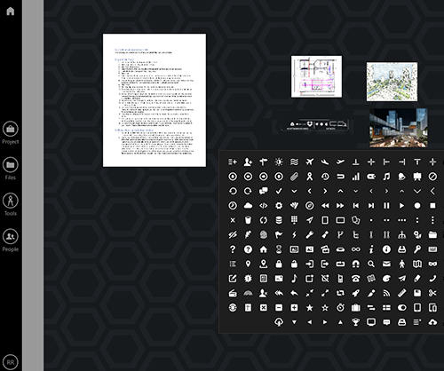
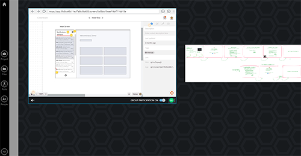
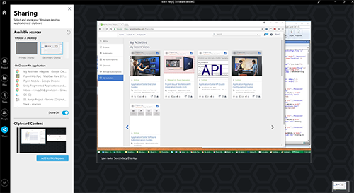
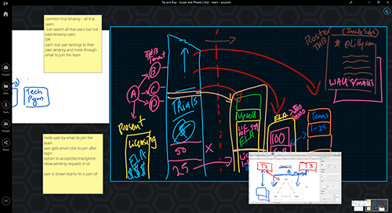

# Unify disconnected applications and ideas

How can you bring together various teams, with their individual
applications and ideas, in one project to achieve a common goal? The
answer is Prysm! Here's an example:

## Four teams, seven applications, many ideas\...one goal!

You're a product manager at a very agile software company. Your Product
Management team is one of four teams working on a very important
software release, and the release date is fast approaching. You need to
work and interact with the three other teams as you simultaneously
advance your deliverables for the software release.

The three other teams are the UX Design team, Software Development team,
and Marketing team.

## Or is it chaos?

Each of your teams has its own ideas &mdash; and different applications to
express those ideas and accomplish their tasks. Normal? Yes. Chaotic?
You bet! Here are just a few of your cross-team needs:

- The Marketing team needs to provide approved text and graphics to UX
  for the UX designs, which tends to happen via emails or chat messages
  that too often get lost or forgotten.
- The UX team uses a wireframing application to create its designs,
  which Product Management and Software Development need to consume, but
  those teams don't have the application UX uses.
- To ensure that everyone likes the results, Software Development needs
  to continually show their progress to UX and Project Management, but
  the most current progress is often on individual developer's
  computers.

## Prysm to the rescue!

You go to Prysm for web ([app.prysm.com](http://app.prysm.com/){target="\_blank"}) and
create a free account. You create a
project. (**Projects** are
anything you want to organize, such as planning an event, or getting a
software release to market.)

In the project's first workspace,
Marketing adds a Microsoft Word
doc that includes their approved
text. (**Workspaces** are places where you can store and visually
organize your content.) They also add various images in various formats.
Marketing and UX have a meeting in this workspace to ensure that UX
understands everything Marketing has handed off to them. After the
meeting, UX can access all the content in the workspace any time.

## Unity emerges

In the second workspace, UX uses a Prysm
[co-browser](../Tools/WebBrowsers.html#OpeningCobrowsers) to let others
view and even interact with the UX design wireframes in their web-based
wireframing application.

Software Development creates their own workspace. They [download the
free Prysm for desktop
app](../GettingStarted/GettingPFD.html#InstalliingPFD), and use it to
[share their desktops](../Share/SharingYourDesktop.htm) with everyone
else in the workspace. This enables Software Development to demo their
incremental builds, which are located on their personal computers.

Product Management participates in all of these workspaces by
[annotating content](../Tools/Annotating.html) to show their desired
changes. They also create their own workspace where they add a
[co-browser](../Tools/WebBrowsers.html) to display their web-based
Microsoft Project tracking tool for them to update and for everyone to
monitor project progress.

## The goal comes back into focus

As everyone uses your Prysm project, all of your teams are able to
unify, regain their focus on the goal, and complete the release of a
great software product on time.

## Imagine how Prysm could unify your applications and ideas!

That was just a simple example to introduce you to some of what Prysm
makes possible. Consider the unique issues that you're facing with too
many applications and ideas, and imagine how Prysm can overcome them for
you!
