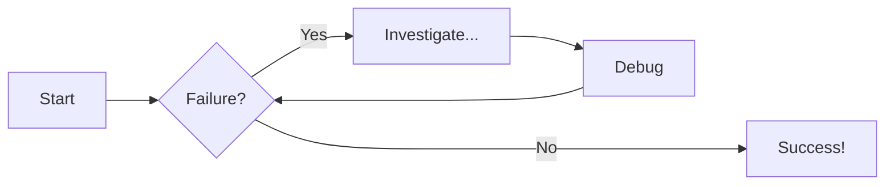
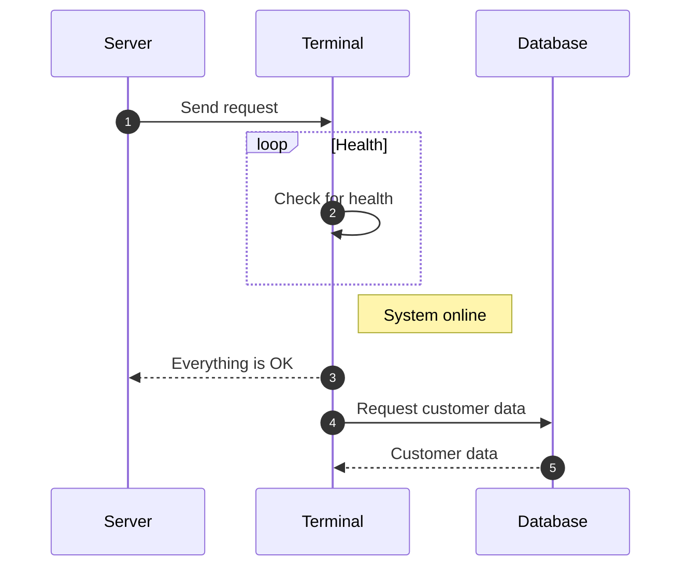

# Design

For all of the content in this portfolio (and links to my content from this portfolio), I designed the sites and created the CSS. The following links give you a couple additional examples:

- [Auto-closing drop-down sections](https://lookatthem-tech.github.io/portfolio001/Content/Topics/Designs/TestHomePg019.htm){target="\_blank"}

- [Content carousel](https://lookatthem-tech.github.io/portfolio001/Content/Topics/Designs/TestHomePg015MCSlideshow.htm){target="\_blank"}

## Content tabs

These are some examples of content tabs.

=== "Plain text"

    This is some plain text

=== "Unordered list"

    * First item
    * Second item
    * Third item

=== "Ordered list"

    1. First item
    2. Second item
    3. Third item

## Code blocks in content tabs

These content tabs provide a way to show code in various languages.

=== "Python"

    ```py
    def main():
        print("Hello world!")

    if __name__ == "__main__":
        main()
    ```

=== "JavaScript"

    ```js
    function main() {
        console.log("Hello world!");
    }

    main();
    ```

## Diagram examples

These diagrams are not .png or other images. They are created with markdown text, which is then built by python and mkdocs into diagrams.

### Flowchart

<p>&nbsp;</p>



<p>&nbsp;</p>
<p>&nbsp;</p>

### Sequence diagram

<p>&nbsp;</p>


